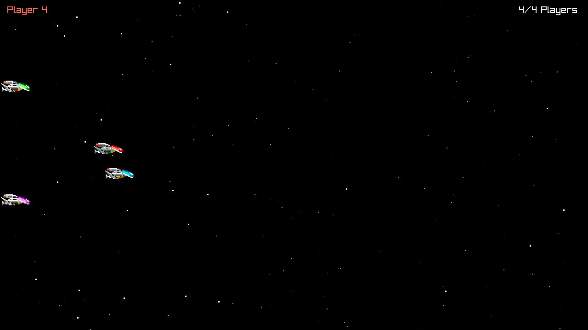

# R-Type language POC: C++

The C++ version of the language POC described in `docs/research/language-pocs.md` (in the `research` workspace): a headless Server and a raylib Client for up to four Players, on a thin home-made Engine, built with xmake and xrepo. C++23 with named modules and `import std`. The findings are in [REPORT.md](REPORT.md).



## Layout

| Part | Where | Modules | Depends on |
| --- | --- | --- | --- |
| Engine, headless | `engine/headless/` | `engine.bytes`, `engine.net`, `engine.time` | Asio (private) |
| Engine, client | `engine/client/` | `engine.client` | raylib (private) |
| Game | `game/` | `game.protocol`, `game.match` | Engine, headless |
| Server program | `server/` | | Game, Engine headless |
| Client program | `client/` | `client.sound`, `client.sprites`, `client.starfield` | Game, both Engine parts |
| Fuzz test | `tests/` | | Game |

`xmake.lua` enforces the arrows: Engine targets may only depend on Engine targets, and the Server, the Game and the fuzz test must stay headless (no raylib, not even through a dependency). The Server never links raylib.

## Build

Every platform needs [xmake](https://xmake.io/guide/quick-start.html) 3.1.1 or later and a compiler that can `import std`. xrepo downloads and builds raylib 6.0 and Asio 1.36.0 on the first configure (plus CMake and Ninja if they are missing); nothing is installed system-wide. The configure step (`xmake f`) is needed once; `xmake` then builds every target in release mode.

### macOS

Apple clang cannot `import std`, so the build uses LLVM 22 from nixpkgs, through a helper that runs xmake in an ephemeral `nix shell`:

```nu
bash scripts/xmake-macos-nix.sh f -y --toolchain=clang
bash scripts/xmake-macos-nix.sh
```

Use `bash scripts/xmake-macos-nix.sh <arguments>` wherever the commands below say `xmake <arguments>`.

### Linux

Install xmake, GCC 15 or later, and the development packages raylib needs ([raylib wiki](https://github.com/raysan5/raylib/wiki/Working-on-GNU-Linux)), for example on Fedora:

```nu
sudo dnf install xmake gcc-c++ alsa-lib-devel mesa-libGL-devel libX11-devel libXrandr-devel libXi-devel libXcursor-devel libXinerama-devel libatomic
xmake f -y
xmake
```

Not tested: this POC was only built on macOS.

### Windows, natively

Install Visual Studio 2022 17.10 or later with the "Desktop development with C++" workload, and xmake (`winget install xmake`). Then:

```nu
xmake f -y
xmake
```

Not tested: no Windows machine was available. See REPORT.md, "The Windows result".

### Windows `.exe` files, cross-built on macOS

With the MinGW-w64 GCC from nixpkgs. Outside a nix build, its wrapper does not know where the `mcfgthread` thread library lives, hence the two variables:

```nu
nix shell nixpkgs#xmake nixpkgs#pkgsCross.mingwW64.buildPackages.gcc --command bash -c 'export NIX_CFLAGS_COMPILE_x86_64_w64_mingw32="-isystem $(nix build --no-link --print-out-paths nixpkgs#pkgsCross.mingwW64.windows.mcfgthreads.dev)/include" NIX_LDFLAGS_x86_64_w64_mingw32="-L$(nix build --no-link --print-out-paths nixpkgs#pkgsCross.mingwW64.windows.mcfgthreads.out)/lib"; xmake f -y -p mingw -a x86_64 --mingw=$(dirname $(dirname $(command -v x86_64-w64-mingw32-g++))) && xmake'
```

The `.exe` files land in `build/mingw/x86_64/release/`. They are self-contained (static C++ runtime, sprite sheet compiled in): copy `r-type_server.exe` and `r-type_client.exe` to the Windows machine and run them from a terminal there. Switch back to macOS with `bash scripts/xmake-macos-nix.sh f -y -p macosx --toolchain=clang`.

## Run

Start the Server, then up to four Clients, each in its own terminal:

```nu
xmake run r-type_server --port 4242
xmake run r-type_client --host 127.0.0.1 --port 4242
```

In a Client, the arrow keys move the Ship, Space fires (a generated "pew", no Projectile yet), and Escape quits. `--host` also takes a host name; the defaults are `127.0.0.1` and `4242`.

A Client can also play on its own and save a Frame, which is how the screenshot above was made:

```nu
xmake run r-type_client --script 1
xmake run r-type_client --script 3 --frames 420 --screenshot shot.png
```

`--script <n>` flies pattern `n` (0 to 3) instead of reading the keyboard, `--frames <n>` quits after `n` Frames, and `--screenshot <file.png>` saves the last one. `xmake run` starts programs in the build directory, so give the screenshot an absolute path to find it easily.

The Server logs Players joining, leaving and timing out, and every five seconds a line of counters, malformed datagrams included. A Client silent for 3 s, for example after `kill -9`, is dropped and the other Clients are told.

## Test

```nu
xmake test
xmake run protocol_fuzz 100000 42
```

`protocol_fuzz` checks that 10,000 random packets survive an encode/decode round trip, then throws random and mutated datagrams at the decoder (100,000 by default; the second argument fixes the random seed) and reports how many it rejected, and why. It fails if a round trip changes a packet or if the decoder allocates.

To run it under AddressSanitizer and UndefinedBehaviorSanitizer, configure the `asan` mode, then switch back:

```nu
xmake f -y -m asan
xmake test
xmake f -y -m release
```

On macOS 26, this needs LLVM 22.1.8 or later (the helper's version): older sanitizer runtimes hang at startup there.

## Editor support

clangd reads the BMIs that the build produces, so build first, then write a compilation database where clangd finds it:

```nu
xmake project -k compile_commands --lsp=clangd build
```

The clangd in your editor must be the same version as the compiler (22.1.8 for the macOS helper): clangd 21 cannot read clang 22's BMIs.
