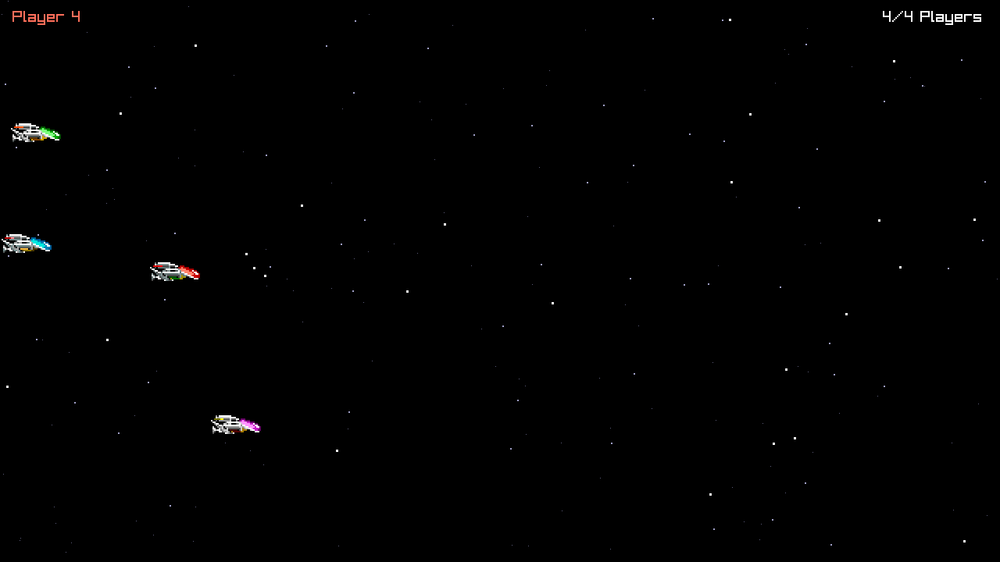

# R-Type language POC: Odin

The Odin version of the language POC described in `docs/research/language-pocs.md` (in the `research` workspace): a headless Server and a raylib Client for up to four Players, on a thin home-made Engine. Odin dev-2026-09, with raylib 6.0 from the compiler's `vendor:` collection, `core:net` and `core:thread`. Odin has no build system: `scripts/build.sh` is the build description.



## Layout

| Part | Package (directory) | Imports |
| --- | --- | --- |
| Engine, headless | `engine/headless` | the core library only |
| Engine, client | `engine/client` | `vendor:raylib` and `vendor:raylib/rlgl` |
| Game | `game` | `engine/headless` |
| Server program | `server` | `game`, `engine/headless` |
| Client program | `client` | `game`, both Engine parts |
| Fuzz test | `tests/fuzz` | `game`, `engine/headless` |
| Layering check | `scripts/check_layering` | the core library only |

An Odin package is a directory, and any package may import any other directory or collection. `scripts/check_layering` holds the rules Odin cannot express, and `scripts/build.sh` runs it before every build: raylib only in `engine/client`, `engine/client` only in the Client program, no public declaration of `engine/client` that names raylib, no other vendor package, no foreign library. The Engine importing the Game is refused by Odin itself, as an import cycle. The Server never links raylib.

The message bodies are `#packed` structs of one-byte and little-endian fields (`u16le`, `u32le`), so their declarations are the wire layout, and the Engine copies them whole (`engine/headless/bytes.odin`, `game/protocol.odin`). The Match lives in `game/match.odin`.

`odin.lock` pins the Odin release and records the SHA-256 of the prebuilt raylib libraries the build expects; see "Upgrading Odin and vendor:raylib".

## Build

Every platform needs the Odin release `odin.lock` names, dev-2026-09, from its [release page](https://github.com/odin-lang/Odin/releases/tag/dev-2026-09): `odin-macos-arm64-dev-2026-09.tar.gz` (62 MB), `odin-linux-amd64-dev-2026-09.tar.gz` (70 MB), `odin-windows-amd64-dev-2026-09.zip` (149 MB). The archive holds the compiler, the core library and the `vendor:` collection, raylib's prebuilt libraries included: there is nothing else to download and nothing to compile but our code. Unpack it and put its folder on `PATH`.

```nu
bash scripts/build.sh
```

The programs land in `out/` (`ODIN_OUT` moves it). The script first checks that `odin version` is the pinned release and that raylib's library is the one `odin.lock` records, then checks the layering, then builds the Server, the Client and the fuzz test with `-o:speed` and Odin's bounds checks, under `-vet -strict-style`. `bash scripts/build.sh debug` builds without optimisation and with debug information, `size` optimises for size, and `unchecked` adds `-no-bounds-check`.

There is no build cache: every build compiles everything, in 4.1–4.6 s on an Apple M5 (1.5–1.7 s in debug).

### macOS

Install the Xcode Command Line Tools (`xcode-select --install`): Odin links with the system's `clang` and finds the macOS SDK with `xcrun`. Then unpack the `odin-macos-arm64` archive and put its folder on `PATH`:

```nu
$env.PATH = ($env.PATH | prepend ~/path/to/the/unpacked/odin)
bash scripts/build.sh
```

A program declares as its minimum the macOS version of the machine that linked it (26.0 here), unless `odin build` is given `-minimum-os-version:11.0` or another version: a build to hand to a teammate on an older Mac needs that flag.

nixpkgs packages Odin too (`nix shell nixpkgs#odin`), but deletes the `vendor/raylib` libraries and makes `vendor:raylib` link a system raylib, so `scripts/build.sh` refuses it (`…/vendor/raylib/macos/libraylib.a is missing`). Its compiler works with the release's own collections, from a checkout of the `dev-2026-09` tag whose raylib libraries come from Git LFS (`nix shell nixpkgs#git-lfs` provides it):

```nu
git clone --branch dev-2026-09 --depth 1 https://github.com/odin-lang/Odin.git odin-dev-2026-09
git -C odin-dev-2026-09 lfs pull --include "vendor/raylib/macos/libraylib.a"
with-env { ODIN_ROOT: (pwd | path join odin-dev-2026-09) } { nix shell nixpkgs#odin --command bash scripts/build.sh }
```

Its programs declare macOS 14.0 as their minimum, the default of nixpkgs' `clang`.

### Linux

Not tested. Unpack the `odin-linux-amd64` (or `-arm64`) archive and put its folder on `PATH`. Odin links with `clang` (Odin supports LLVM 17 to 22), and vendor:raylib links the system's X11 library:

```nu
sudo apt install clang libx11-dev
bash scripts/build.sh
```

### Windows, natively

Not tested. Odin needs the MSVC compiler and the Windows SDK, from the "Desktop development with C++" component of Visual Studio ([install docs](https://odin-lang.org/docs/install/)); installing them means accepting Microsoft's licence. Unpack the `odin-windows-amd64` archive, put its folder on `PATH`, then:

```nu
mkdir out
odin run scripts/check_layering -- .
odin build server -o:speed -vet -strict-style -out:out/r-type_server.exe
odin build client -o:speed -vet -strict-style -out:out/r-type_client.exe
odin build tests/fuzz -o:speed -vet -strict-style -out:out/protocol_fuzz.exe
```

`scripts/build.sh` is a bash script, so on Windows the `odin.lock` check is left to `engine/client`'s compile-time check of the raylib version. On Windows the fuzz test counts the allocations made through the context only.

### Windows `.exe` files, cross-built on macOS

Not supported: `odin build server -target:windows_amd64` writes `r-type_server.obj`, prints "Linking for cross compilation for this platform is not yet supported (windows amd64)" and exits with status 0 ([odin-lang/Odin#4821](https://github.com/odin-lang/Odin/issues/4821)). Linking that object by hand works for the Server, with LLD and MinGW-w64's runtime (the result was not run), but not for the Client: `vendor/raylib/windows/raylib.lib` was built by MSVC and needs its C runtime. Build on Windows.

## Run

Start the Server, then up to four Clients, each in its own terminal:

```nu
out/r-type_server --port 4242
out/r-type_client --host 127.0.0.1 --port 4242
```

In a Client, the arrow keys move the Ship, Space fires (a generated "pew", no Projectile yet), and Escape quits. `--host` also takes a host name; the defaults are `127.0.0.1` and `4242`.

A Client can also play on its own and save a Frame, which is how the screenshot above was made:

```nu
out/r-type_client --script 1
out/r-type_client --script 3 --frames 420 --screenshot shot.png
```

`--script <n>` flies pattern `n` (0 to 3) instead of reading the keyboard, `--frames <n>` quits after `n` Frames, and `--screenshot <file.png>` saves the last one. raylib cannot open a window while the display sleeps (`GLFW: Failed to determine Monitor to center Window`).

The Server logs Players joining, leaving and timing out, and every five seconds a line of counters, malformed datagrams included. A Client silent for 3 s, for example after `kill -9`, is dropped and the other Clients are told. The programs speak the same protocol as the C++, Rust and Zig POCs', byte for byte, and mix freely with them.

## Test

```nu
bash scripts/build.sh test
out/protocol_fuzz 100000 42
out/protocol_fuzz 5000000 7
```

`bash scripts/build.sh test` runs the unit tests with `odin test`: the byte reader and writer, the UDP transport and the fixed-step clock, the random generator against the reference SplitMix64, the exact bytes of every message, every rejection reason, the wire layout of every message body, and the Match rules. They live next to the code, in `*_test.odin` files tagged `#+test`, which only `odin test` compiles.

`protocol_fuzz` checks that 10,000 random packets survive an encode/decode round trip, then throws random and mutated datagrams at the decoder (100,000 by default; the second argument fixes the random seed) and reports how many it rejected, and why. It draws its datagrams exactly as the Rust and Zig POCs' fuzz tests do, so with the same seed all three print the same tallies. It fails if a round trip changes a packet or if the decoder allocates: it counts allocations through Odin's implicit `context` and, on macOS and Linux, calls to the C library's `malloc` family and `mmap`, which `scripts/build.sh` routes through counting functions with linker aliases. A failed bounds check stops it with the offending datagram printed.

## Checking the layering

There is nothing to install: `scripts/build.sh` builds and runs `scripts/check_layering` before the programs, and stops with a message naming the import or the declaration that breaks ADR 0001, for example:

```text
server/main.odin(16:1) ADR 0001: server may not import "vendor:raylib": raylib stays behind the Engine's client part
engine/client/client.odin(166:42) ADR 0001: engine/client's public texture_raw exposes raylib's rl.Texture2D: raylib stays behind the Engine's client part
```

It can also run alone: `odin run scripts/check_layering -- .`. It reads the sources with `core:odin/parser`, so it sees imports and declarations, not types. `otool -L out/r-type_server` lists `libSystem.B.dylib` alone.

Odin's stricter static checks pass too, beyond the `-vet -strict-style` of every build:

```nu
for program in [server client tests/fuzz scripts/check_layering] { odin check $program -vet -strict-style -vet-cast -vet-using-param -vet-tabs -vet-semicolon }
```

## Upgrading Odin and vendor:raylib

A raylib update reaches `vendor:raylib` only with an Odin release. To move to a new release:

1. Read its release notes and what changed in `vendor/raylib` since the pinned one, for example `git log dev-2026-09..dev-2026-10 -- vendor/raylib` in a clone of [odin-lang/Odin](https://github.com/odin-lang/Odin).
2. Install the new release, then set its tag and commit on the `odin` line of `odin.lock`.
3. Run `bash scripts/build.sh`. It stops if a raylib library changed, and `engine/client` stops the build if raylib's version changed.
4. Record the new libraries' SHA-256 in `odin.lock` (`shasum -a 256`, or the oids `git lfs ls-files -l` prints in the clone), and, for a new raylib version, its version in `engine/client/client.odin` after reading raylib's changelog.
5. Run the unit tests, the fuzz test and a Match, then commit the lock with the code it needed, on every platform's CI.

## Editor support

[OLS](https://github.com/DanielGavin/ols), the Odin language server. Its releases are named like Odin's but do not follow them month for month: on 2026-10-05 the newest is dev-2026-08, besides a nightly, and there is no dev-2026-09. `nix shell nixpkgs#ols` gives dev-2026-08. With no configuration file, it found the definitions of `headless.open`, `game.encode` and `engine.open_window` from the Client's code: the imports are relative paths. Its completions also offer the procedures of `#+test` files, which only `odin test` compiles.
