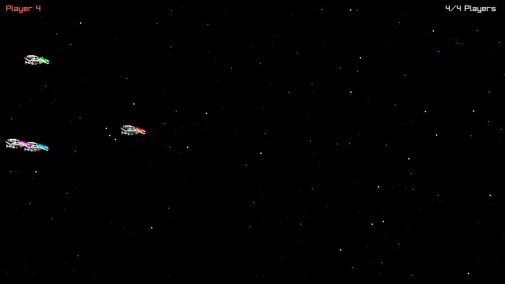

# R-Type language POC: Rust

The Rust version of the language POC described in `docs/research/language-pocs.md` (in the `research` workspace): a headless Server and a raylib Client for up to four Players, on a thin home-made Engine, in one Cargo workspace. Stable Rust 1.98.1, edition 2024, no `unsafe` outside the fuzz test's allocator. The findings are in [REPORT.md](REPORT.md).



## Layout

| Part | Crate (package) | Where | Depends on |
| --- | --- | --- | --- |
| Engine, headless | `engine-headless` | `engine/headless/` | the standard library only |
| Engine, client | `engine-client` | `engine/client/` | `raylib` 6.0.0 (private) |
| Game | `game` | `game/` | `engine-headless` |
| Server program | `r-type-server`, binary `r-type_server` | `server/` | `game`, `engine-headless` |
| Client program | `r-type-client`, binary `r-type_client` | `client/` | `game`, both Engine parts |
| Fuzz test | `protocol-fuzz`, test `protocol_fuzz` | `tests/` | `game`, `engine-headless` |

A crate can only use the crates listed in its own `Cargo.toml`, and Cargo refuses dependency cycles. `deny.toml` adds the rules Cargo cannot express: raylib may only be a dependency of `engine-client`, `engine-client` only of the Client program, and `game` only of the programs and the fuzz test. The Server never links raylib. The Match lives in `game::rules`, because `match` is a Rust keyword.

## Build

Every platform needs [rustup](https://rustup.rs), a C compiler, [CMake](https://cmake.org/download/) and libclang: the `raylib` crate builds raylib 6.0 from its bundled sources with CMake, and generates its bindings with bindgen, which loads libclang. `rust-toolchain.toml` pins the toolchain: the first `cargo` command in this folder installs Rust 1.98.1 with Clippy and rustfmt. Cargo downloads the crates listed in `Cargo.lock` on the first build.

```nu
cargo build --release
```

The programs land in `target/release/`. Use a `cargo` provided by rustup: a `cargo` installed some other way, such as nixpkgs' `cargo` package, ignores `rust-toolchain.toml`.

### macOS

Install the Xcode Command Line Tools (`xcode-select --install`), which bring the C compiler, the linker and a libclang that bindgen finds on its own, then rustup and CMake. With Nix, rustup and CMake can stay out of your profile:

```nu
nix shell nixpkgs#rustup nixpkgs#cmake --command cargo build --release
```

### Linux

Install rustup, then a C compiler, CMake, libclang and the development packages raylib needs ([raylib wiki](https://github.com/raysan5/raylib/wiki/Working-on-GNU-Linux), [raylib-rs README](https://github.com/raylib-rs/raylib-rs)), for example on Debian or Ubuntu:

```nu
curl --proto '=https' --tlsv1.2 -sSf https://sh.rustup.rs | sh
sudo apt install build-essential libclang-dev cmake libasound2-dev libudev-dev libx11-dev libxrandr-dev libxinerama-dev libxcursor-dev libxi-dev libgl1-mesa-dev
cargo build --release
```

On Fedora, the packages are `gcc cmake clang-devel alsa-lib-devel mesa-libGL-devel libX11-devel libXrandr-devel libXi-devel libXcursor-devel libXinerama-devel libatomic`. The `raylib` crate builds GLFW's X11 backend; for Wayland, see its `wayland` feature. Not tested: this POC was only built on macOS.

### Windows, natively

Install:

1. The Visual Studio 2022 C++ build tools: the "Desktop development with C++" workload, or at least "MSVC v143 - VS 2022 C++ x64/x86 build tools" and a Windows 11 SDK ([rustup's guide](https://rust-lang.github.io/rustup/installation/windows-msvc.html)).
2. rustup, with [rustup-init.exe](https://static.rust-lang.org/rustup/dist/x86_64-pc-windows-msvc/rustup-init.exe) and its default MSVC host.
3. CMake (`winget install Kitware.CMake`) and LLVM for libclang (`winget install LLVM.LLVM`, from [bindgen's requirements](https://rust-lang.github.io/rust-bindgen/requirements.html)).

Then, in a new terminal:

```nu
$env.LIBCLANG_PATH = 'C:\Program Files\LLVM\bin'
cargo build --release
```

Not tested: no Windows machine was available. See REPORT.md, "The Windows result".

### Windows `.exe` files, cross-built on macOS

With the MinGW-w64 GCC from nixpkgs, through a helper that sets up an ephemeral `nix shell` (its comments explain the three workarounds it needs):

```nu
bash scripts/build-windows-exe.sh
```

The `.exe` files land in `target/x86_64-pc-windows-gnu/release/`. They only import Windows' own DLLs (the Rust standard library, the C runtime pieces and the sprite sheet are compiled in): copy `r-type_server.exe` and `r-type_client.exe` to the Windows machine and run them from a terminal there.

## Run

Start the Server, then up to four Clients, each in its own terminal:

```nu
cargo run --release --bin r-type_server -- --port 4242
cargo run --release --bin r-type_client -- --host 127.0.0.1 --port 4242
```

In a Client, the arrow keys move the Ship, Space fires (a generated "pew", no Projectile yet), and Escape quits. `--host` also takes a host name; the defaults are `127.0.0.1` and `4242`.

A Client can also play on its own and save a Frame, which is how the screenshot above was made:

```nu
cargo run --release --bin r-type_client -- --script 1
cargo run --release --bin r-type_client -- --script 3 --frames 420 --screenshot shot.png
```

`--script <n>` flies pattern `n` (0 to 3) instead of reading the keyboard, `--frames <n>` quits after `n` Frames, and `--screenshot <file.png>` saves the last one. `cargo run` starts the programs in the current folder, so a relative screenshot path lands here.

The Server logs Players joining, leaving and timing out, and every five seconds a line of counters, malformed datagrams included. A Client silent for 3 s, for example after `kill -9`, is dropped and the other Clients are told. The programs speak the same protocol as the C++ POC's, byte for byte, and mix freely with them.

## Test

```nu
cargo test
cargo test --release -p protocol-fuzz -- 100000 42
```

`cargo test` runs the unit tests (the byte reader and writer, the random generator, the wire layout of every message, the Match rules) and the fuzz test. `protocol_fuzz` checks that 10,000 random packets survive an encode/decode round trip, then throws random and mutated datagrams at the decoder (100,000 by default; the second argument fixes the random seed) and reports how many it rejected, and why. It fails if a round trip changes a packet, if the decoder panics or if it allocates. Run in the default debug profile, it also turns any integer overflow in the decoder into a failure.

`protocol_fuzz` is a plain program (`harness = false`), not a libtest suite: a `cargo test <filter>` meant for the unit tests makes it fail with its usage line. Filter by package instead, for example `cargo test -p game`.

Lints and formatting, as checked for REPORT.md:

```nu
cargo clippy --workspace --all-targets -- -D warnings
cargo fmt --all --check
```

## Checking the layering

Install [cargo-deny](https://github.com/EmbarkStudios/cargo-deny) (for example `nix shell nixpkgs#cargo-deny`), then:

```nu
cargo deny check bans
```

It prints `bans ok`, or names the dependency that breaks ADR 0001 and why. `cargo tree -p r-type-server` shows the Server's whole dependency graph, which holds no raylib.

## Editor support

rust-analyzer reads the Cargo workspace directly: install it with `rustup component add rust-analyzer` (in this folder, so that it matches the pinned toolchain), and point your editor at that binary.
