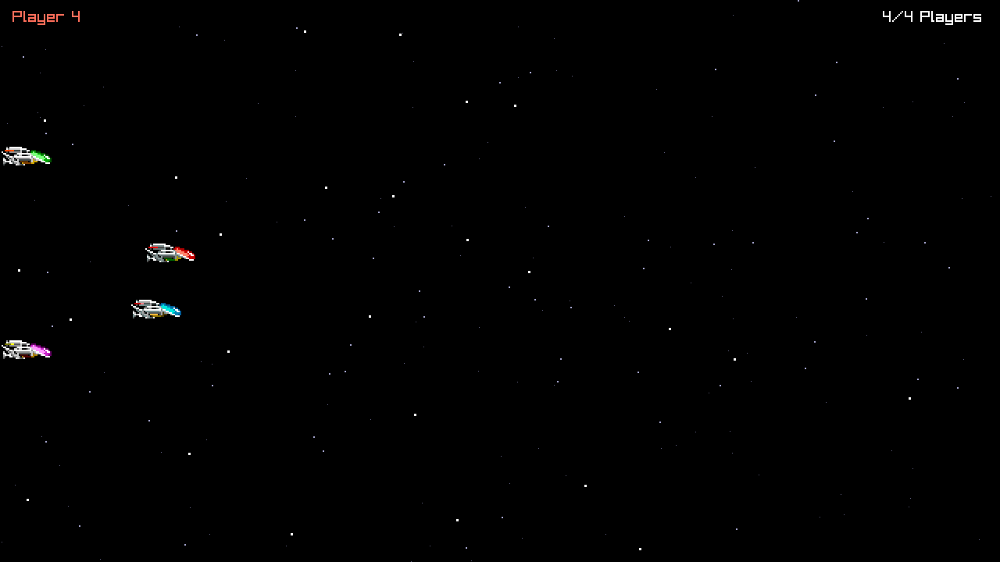

# R-Type language POC: Zig

The Zig version of the language POC described in `docs/research/language-pocs.md` (in the `research` workspace): a headless Server and a raylib Client for up to four Players, on a thin home-made Engine, built by `build.zig`. Zig 0.16.0, with raylib 6.0 through [raylib-zig](https://github.com/raylib-zig/raylib-zig).



## Layout

| Part | Module (in `build.zig`) | Where | Imports |
| --- | --- | --- | --- |
| Engine, headless | `engine_headless` | `engine/headless/` | the standard library only |
| Engine, client | `engine_client` | `engine/client/` | `raylib` (raylib-zig's binding, which links raylib) |
| Game | `game` | `game/` | `engine_headless` |
| Server program | `r-type_server` | `server/` | `game`, `engine_headless` |
| Client program | `r-type_client` | `client/` | `game`, both Engine parts |
| Fuzz test | `protocol_fuzz` | `tests/` | `game` |

A Zig file can only `@import` the modules its module was given in `build.zig`, and files inside its own module's directory. `build.zig` adds the rules Zig cannot express, and checks them every time the build is configured: raylib may only be imported by `engine_client`, `engine_client` only by the Client program, and `game` only by the programs and the fuzz test. The Server never links raylib.

The message encoder and decoder are derived at compile time from the message types (`engine/headless/bytes.zig`, `game/protocol.zig`). The Match lives in `game/match.zig`.

## Build

Every platform needs [Zig 0.16.0](https://ziglang.org/download/), which compiles raylib's C code itself and brings its own C library headers and linker: no CMake, no other compiler, no `git`. To link the Client, macOS also needs the Xcode Command Line Tools, whose SDK holds the system frameworks, and Linux needs X11 development packages (see below). On the first build, `zig build` downloads the packages pinned in `build.zig.zon` (raylib-zig, then raylib 6.0 and what raylib's `build.zig` declares: 87 MB on this Mac) into the global Zig cache, and unpacks them into `zig-pkg/` next to `build.zig`. Zig 0.16 has no setting to move `zig-pkg/`; it is in `.gitignore`.

```nu
zig build -Doptimize=ReleaseSafe
```

The programs land in `zig-out/bin/`. `-Doptimize` also takes `Debug` (the default, with the same safety checks), `ReleaseFast` and `ReleaseSmall` (neither checks bounds or overflow). `-p <dir>` installs elsewhere, and `--cache-dir <dir>` moves `.zig-cache/`.

### macOS

Install the Xcode Command Line Tools (`xcode-select --install`): without them the Server builds, but the Client cannot find the system frameworks it links. Then install Zig 0.16.0 from [ziglang.org](https://ziglang.org/download/) (unpack the `aarch64-macos` archive and put its folder on `PATH`), or use it from nixpkgs without installing it:

```nu
nix shell nixpkgs#zig_0_16 --command zig build -Doptimize=ReleaseSafe
```

A native build requires the version of macOS it was built on, or later. `-Dtarget=aarch64-macos.14.0` lowers that for the Server, but the Client then fails to link: build the Client on each Mac.

### Linux

Not tested. Install Zig 0.16.0 from [ziglang.org](https://ziglang.org/download/). raylib's `build.zig` links GLFW's X11 backend against the system's X11 libraries (`X11`, `Xrandr`, `Xinerama`, `Xi`, `Xcursor`), so install their development packages, for example on Debian or Ubuntu the ones the [raylib wiki](https://github.com/raysan5/raylib/wiki/Working-on-GNU-Linux) lists:

```nu
sudo apt install libasound2-dev libx11-dev libxrandr-dev libxi-dev libgl1-mesa-dev libglu1-mesa-dev libxcursor-dev libxinerama-dev libwayland-dev libxkbcommon-dev
zig build -Doptimize=ReleaseSafe
```

### Windows, natively

Not tested. Unpack the `x86_64-windows` archive of Zig 0.16.0 from [ziglang.org](https://ziglang.org/download/), put its folder on `PATH`, then:

```nu
zig build -Doptimize=ReleaseSafe
```

Zig targets Windows with the MinGW-w64 C library it ships: no Visual Studio, Windows SDK or CMake is involved, and so no license to accept.

### Windows `.exe` files, cross-built on macOS

```nu
zig build -Doptimize=ReleaseSafe -Dtarget=x86_64-windows
```

The `.exe` files land in `zig-out/bin/`, next to their `.pdb` debug files. They import only Windows' own DLLs (the Server imports `ntdll` and `KERNEL32` alone): copy `r-type_server.exe` and `r-type_client.exe` to the Windows machine and run them from a terminal there.

## Run

Start the Server, then up to four Clients, each in its own terminal:

```nu
zig build server -Doptimize=ReleaseSafe -- --port 4242
zig build client -Doptimize=ReleaseSafe -- --host 127.0.0.1 --port 4242
```

or run the installed programs directly, `zig-out/bin/r-type_server` and `zig-out/bin/r-type_client`. In a Client, the arrow keys move the Ship, Space fires (a generated "pew", no Projectile yet), and Escape quits. `--host` also takes a host name; the defaults are `127.0.0.1` and `4242`.

A Client can also play on its own and save a Frame, which is how the screenshot above was made:

```nu
zig-out/bin/r-type_client --script 1
zig-out/bin/r-type_client --script 3 --frames 420 --screenshot shot.png
```

`--script <n>` flies pattern `n` (0 to 3) instead of reading the keyboard, `--frames <n>` quits after `n` Frames, and `--screenshot <file.png>` saves the last one.

The Server logs Players joining, leaving and timing out, and every five seconds a line of counters, malformed datagrams included. A Client silent for 3 s, for example after `kill -9`, is dropped and the other Clients are told. The programs speak the same protocol as the C++ and Rust POCs', byte for byte, and mix freely with them.

## Test

```nu
zig build test
zig build fuzz -- 100000 42
zig build fuzz -Doptimize=ReleaseSafe -- 5000000 7
```

`zig build test` runs the unit tests: the byte reader and writer and the derived encoding, the UDP transport and the fixed-step clock, the exact bytes of every message, every rejection reason, and the Match rules. `protocol_fuzz` checks that 10,000 random packets survive an encode/decode round trip, then throws random and mutated datagrams at the decoder (100,000 by default; the second argument fixes the random seed) and reports how many it rejected, and why. It draws its datagrams exactly as the Rust POC's fuzz test does, so with the same seed the two print the same tallies. It fails if a round trip changes a packet or if the decoder calls the C library's allocation functions (`malloc` and its variants, `mmap`), which every allocator of Zig's standard library ends up calling on macOS and Linux. In Debug and ReleaseSafe builds, a failed bounds or overflow check stops it with the offending datagram printed.

Formatting, as checked for the report:

```nu
zig fmt --check build.zig build.zig.zon engine game server client tests
```

## Checking the layering

There is nothing to install or run: `build.zig` checks the imports of every module each time the build is configured, and stops with a message naming the import that breaks ADR 0001, for example:

```text
error: ADR 0001: server/main.zig may not import "engine_client": only the Client program draws: the Server and the Game stay headless
```

`engine/client/api_check.zig` adds a compile-time check that no public declaration of the Engine's client part exposes a raylib type, for example:

```text
error: root.Texture.raw exposes fn (*const root.Texture) raylib.Texture, from raylib.zig, which this module keeps hidden
```

Zig names a type after the file that declares it, so the check is given the names of raylib-zig's files (`raylib`, `rlgl`, `raymath` and their `-ext` companions, listed in `engine/client/root.zig`): a raylib-zig upgrade that adds a file must add it there. `otool -L zig-out/bin/r-type_server` lists `libSystem.B.dylib` alone.

## Editor support

[ZLS](https://github.com/zigtools/zls), the Zig language server, must match the compiler: ZLS 0.16.0 for Zig 0.16.0, for example `nix shell nixpkgs#zls` or a release from its repository. It runs `build.zig` with a build runner of its own to learn the modules and their imports, so "go to definition" follows `@import("game")` and the others. A file opened before ZLS has finished reading `build.zig` may stay unresolved until it is reopened. On macOS, ZLS keeps its cache and log in `~/Library/Caches/zls` (`zls env` prints the paths).
